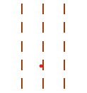

## Opdracht 1

In deze opdracht gaan we de basis van het bord dat in de console moet worden getoond programmeren. We laten nog even de scheidingslijnen weg:

#### Ter voorbereiding
Maak een nieuwe branch en noem deze solution gevolgd door het nummer van de oefening en je eigen initialen. Stel bijv. dat je de initialen BvS hebt en je hebt _exercise1_ uitgecheckt. Voer dan in het Terminal venster het volgende commando uit:

   `git checkout -b solution1-bvs`

Voer regelmatig een commit uit, vooral als je een onderdeel van een opdracht af hebt. 
   Voeg altijd vóór een commit eerst alle bestanden toe aan GIT met `git add .` Daarna de commit uitvoeren met bijv. `git commit -m "Empty board"`

#### De deelopdrachten

- Voeg in de package _nl.novi_ waar _Main_ staat een nieuwe klasse _Board_ toe. 

- Voeg toe aan de klasse _Board_ de variabelen _numRows_ en _numColumns_. Maak deze private.

- Elk veld van het bord ziet er hetzelfde uit. Voeg ook een private variabele _fieldTemplate_ toe waarin we de basis string van elk veld kunnen opslaan.

- Voeg aan de klasse Board een constructor toe waarbij alle variabelen kunnen worden ingesteld. Voeg ook een default constructor toe waarbij `numRows = 5` en `numColumns = 3` en `fieldTemplate = "  |"`

- Voeg een methode `print()` toe. Voeg hierin code toe die het basisbord in de console afdrukt.

- Voeg code toe aan _Main_ waarin een nieuw Board object wordt gecreeerd en dit bord wordt afgedrukt. Doe dit voor een standaard bord en ook voor een bord met 5 rijen en 10 colommen en zo dat elk veld bestaat uit `"[ ]"`.     
  
- Voer een commit uit na het voltooien van de opdracht! 

- Ga door naar de volgende opdracht met `git checkout exercise2`