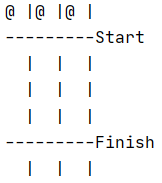

##Welkom bij de Java oefening GuineaPigRace!

####Vereiste voorkennis en installatie

Basiskennis Java. IntelliJ en GIT. Commando's in het Terminal venster uitvoeren.

####Wat gaan we maken?

We gaan een hamsterrace spel maken dat als volgt moet gaan werken:

1. Er zijn 3 hamsters die tegen elkaar racen.
2. Er wordt een bord gebruikt waarbij elke kolom een race track van een hamster voorstelt. De hamsters worden aangeduid met een teken zoals @, X, etc. naar keuze.

Het bord moet er in de console bij de start van het spel zo uitzien:

2. Bij elke ronde moet elke speler een getal raden tussen 0 en het aantal spelers - 1. In het geval van 3 spelers dus een getal tussen 0 en 2. De eerste speler die goed geraden heeft mag 1 sprong vooruit zetten. Aan het einde van een ronde wordt steeds het bord getoond met de posities van de spelers. 

3. De eerste speler die over de finishlijn komt heeft gewonnen! Daarmee is het spel beeindigd.

4. Er moet eenvoudig kunnen worden gewijzigd:

	- het aantal spelers (hamsters)
	- het aantal te winnen rondes
	- het teken dat een hamster aanduidt.

####Hoe gaan we dit aanpakken?

We gaan de applicatie opsplitsen in een aantal duidelijke, overzichtelijke deeltaken en deze één voor één programmeren. Anders gezegd: we verdelen de applicatie in een aantal te realiseren _functionaliteiten_ (in het Engels _features_). Elke feature ga je realiseren in een aparte opdracht. Dit zijn de deeltaken:

1. Een leeg bord in de console tonen.

2. Een bord met één of meer tokens in de console tonen.

3. Een willekeurig nummer genereren

4. Spelersinvoer vragen in de console en opslaan zodat deze verder gebruikt kan worden.

5. Spelersinvoer ontvangen en bepalen wie gewonnen heeft. We spelen dus zo één ronde.

6. Een ronde spelen waarbij de positie van de spelers wordt bijgehouden.

7. Een ronde spelen waarna het bord wordt geprint met de juiste posities van de spelers.

8. Twee rondes spelen

9. Rondes spelen tot één van de spelers heeft gewonnen. In de console tonen welke speler heeft gewonnen.

####Hoe voer je de opdrachten uit?

Elke opdracht kun je vinden een eigen GIT branch. Ga bij de start van elke volgende opdracht als volgt te werk:

1. Check uit de branch van de oefening bijv. :
    `git checkout exercise1`

    In elke branch wordt in README de opdracht uitgelegd.
    
2. Maak een nieuwe branch en noem deze solution gevolgd door het nummer van de oefening en je eigen initialen. Stel bijv. dat je de initialen BvS hebt en je hebt _exercise1_ uitgecheckt. Voer dan in het Terminal venster het volgende commando uit:

   `git checkout -b solution1-bvs`

3. Lees zorgvuldig de opdracht in README.md

4. Voer regelmatig een commit uit, vooral als je een onderdeel van een opdracht af hebt. 
   Voeg altijd vóór een commit eerst alle bestanden toe aan GIT met `git add .` Daarna de commit uitvoeren met bijv. `git commit -m "Empty board"`

####We gaan beginnen!

Ga nu naar de branch van de eerste opdracht met `git checkout -b exercise1` Veel plezier!