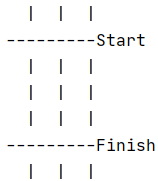

##Opdracht 2

In opdracht 1 hebben we een basis bord geprogrammeerd. In opdracht 2 gaan we de start- en finishlijn toevoegen:

Maak een nieuwe branch en noem deze _solution2_ gevolgd door je eigen initialen. Stel bijv. dat je de initialen BvS hebt. Je voert dan uit `git checkout -b solution2-bvs`

Voer regelmatig een commit uit, vooral als je een deelopdracht af hebt. 
   Voeg altijd vóór een commit eerst alle bestanden toe aan GIT met `git add .` Daarna de commit uitvoeren met bijv. `git commit -m "Empty board"`

Deelopdrachten:

- Kopieer eerst je _Board.java_ bestand uit de door jouw gemaakte branch solution1 naar deze solution2 branch. Stel dat je initialen BvS zijn. Voer dan uit:

    `git checkout solution1-bvs src/nl/novi/Board.java`
    
- voeg aan _Board_ een nieuwe methode toe `printSeparatorLine()` In deze methode moet een lijn worden afgedrukt bestaande uit streepjes. Het aantal streepjes moet gelijk zijn aan de breedte van een rij van het bord. Aan het eind van de rij moet een extra tekst kunnen worden toegevoegd. Geef deze aan de methode mee als parameter. Tip: je kunt gebruik maken van `String.repeat()`

- Test bovenstaande methode in Main. Maak daarvoor een nieuw _Board_ object met naam _board_ en voer uit `board.printSeparatorLine("Start")`

- Voeg aan `Board.print()` code toe die er voor zorgt dat na de eerste rij de startlijn wordt afgedrukt en vóór de laatste rij de finishlijn.

- Test in Main `Board.print()` en experimenteer met verschillende aantallen rijen en kolommen.

